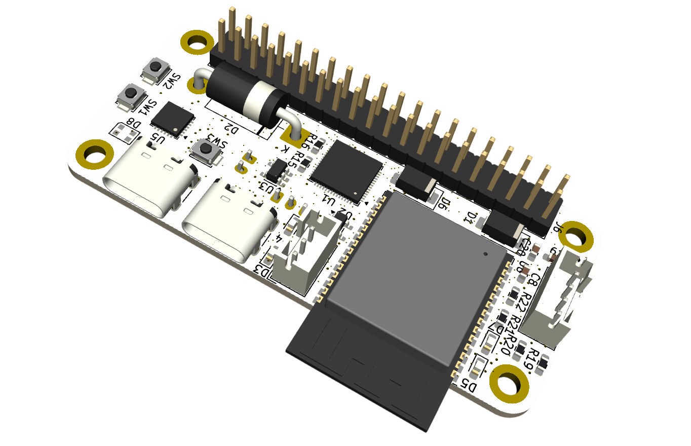
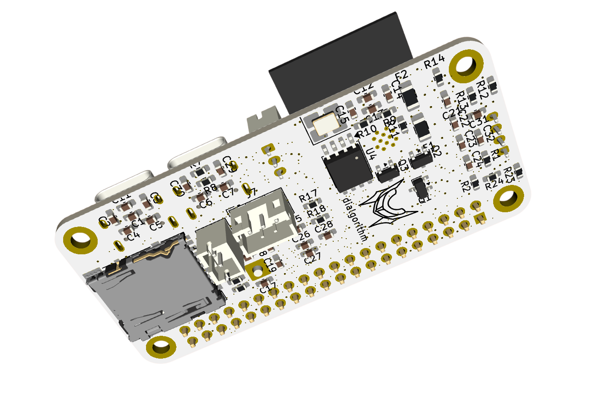
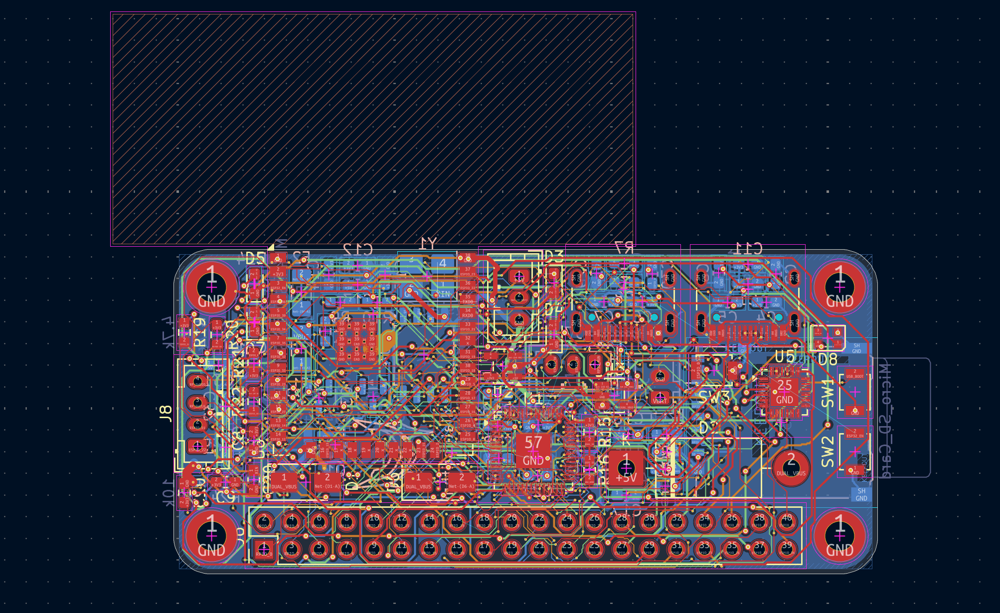
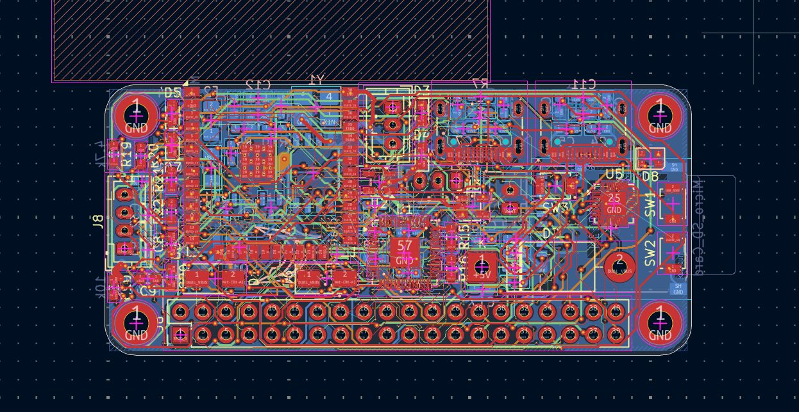
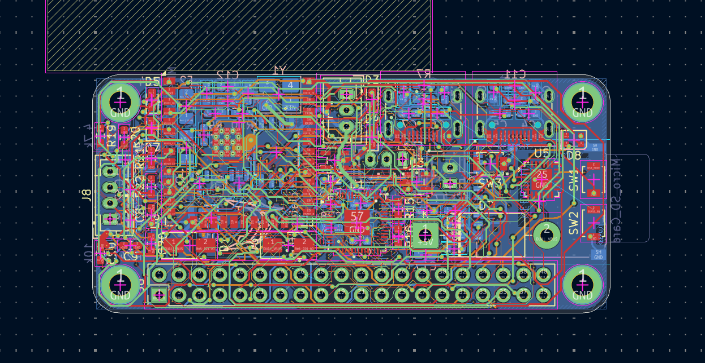
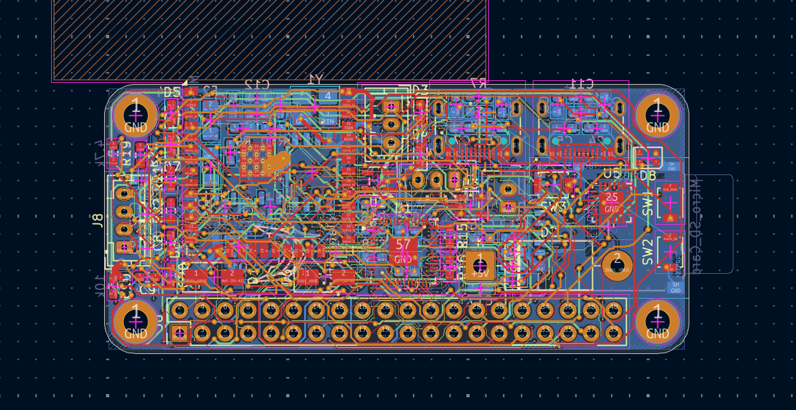
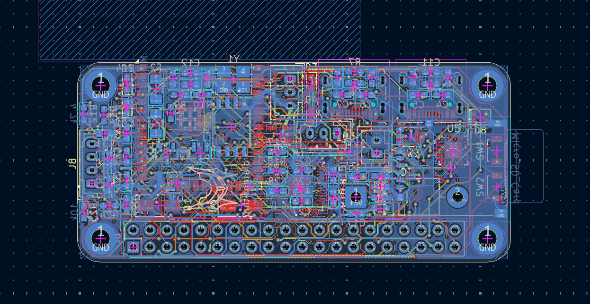

<h1 align="center">
  dyad
   
</h1>

<h4 align="center">
    esp32 + rp2040 dev board that's rpi zero sized
</h4>

## it features

- **ESP32-WROOM-32E** as the main controller
- **RP2040** as the secondary controller
- **micro sd** support
- **flash memory** for rp2040
- **dual** usb c, one for each mcu

## design

### 3d

| front                             | back                       |
| --------------------------------- | -------------------------- |
|  |  |

### overview

| schematic                           | pcb                    |
| ----------------------------------- | ---------------------- |
|  |  |

### layered pcb routes

| top layer                        | first layer                   |
| -------------------------------- | ----------------------------- |
|  |  |

| second layer                        | bottom layer                  |
| ----------------------------------- | ----------------------------- |
|  |  |
